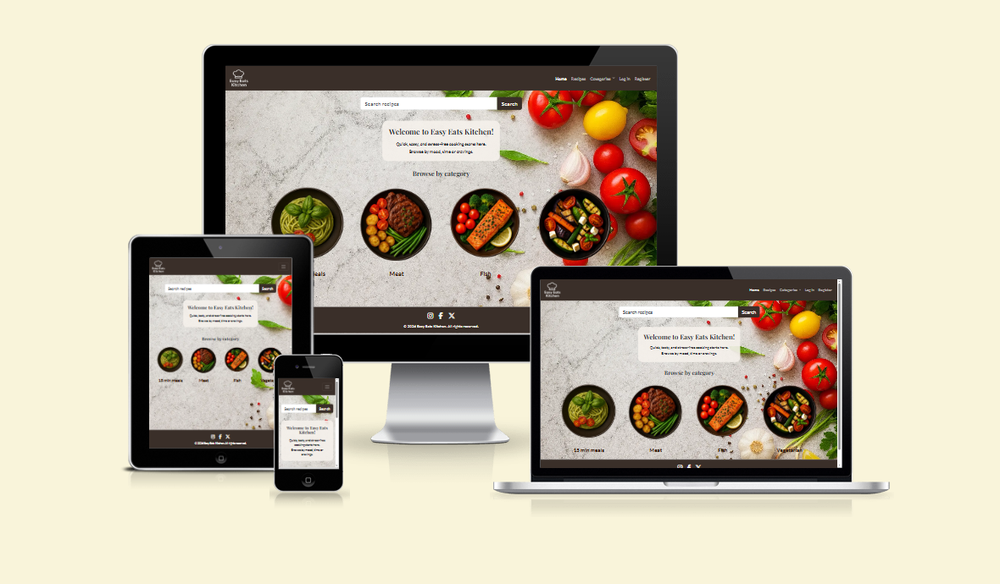
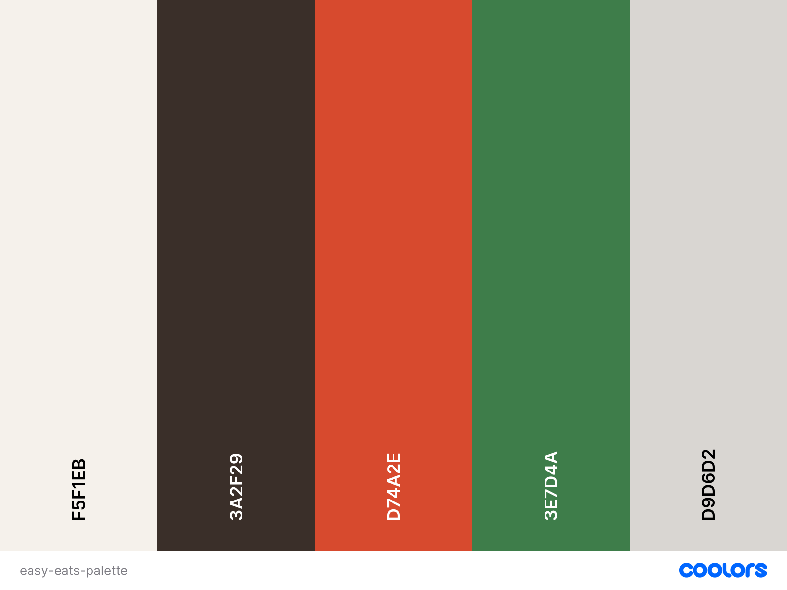
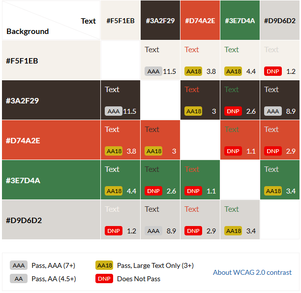
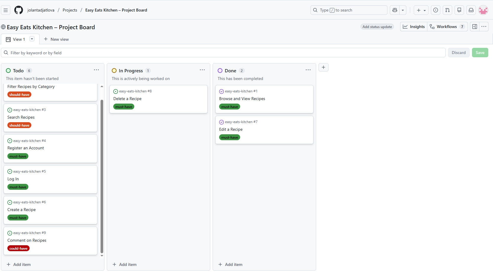
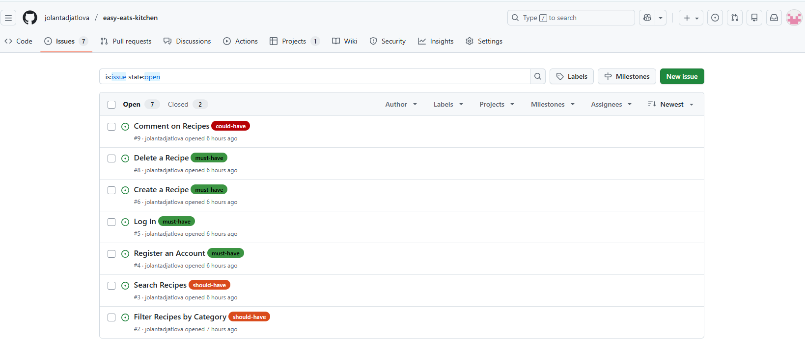
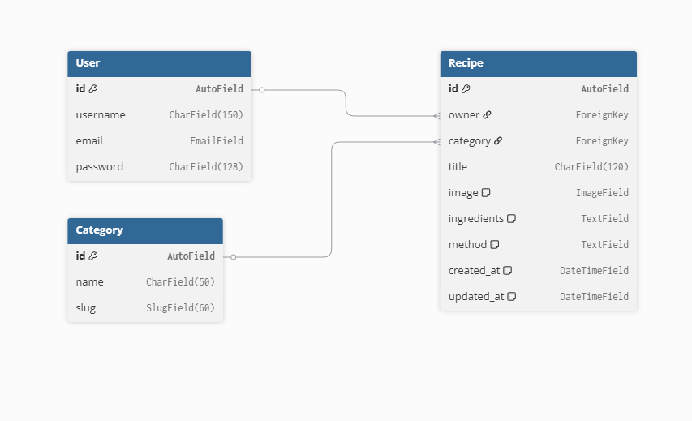
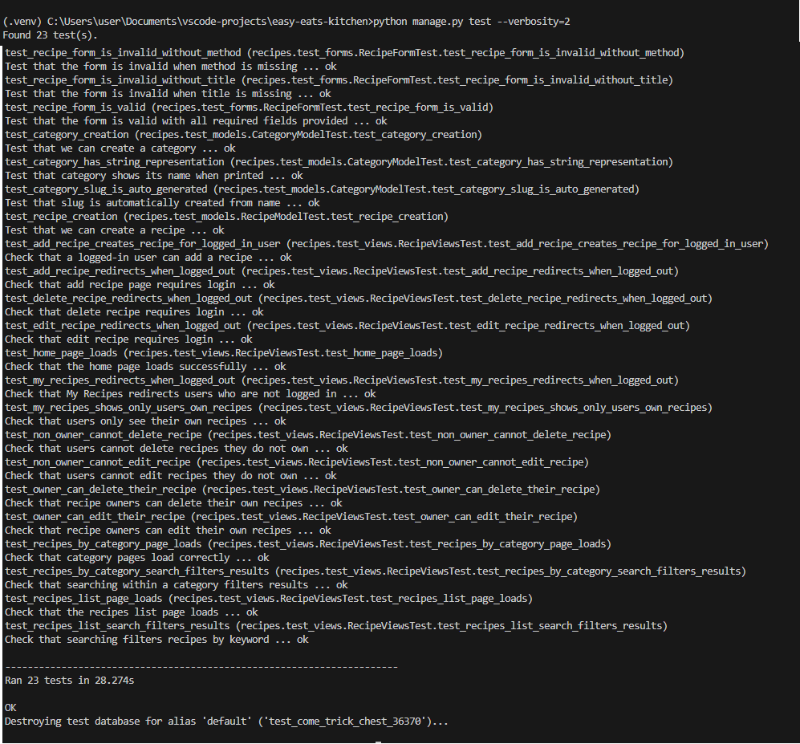
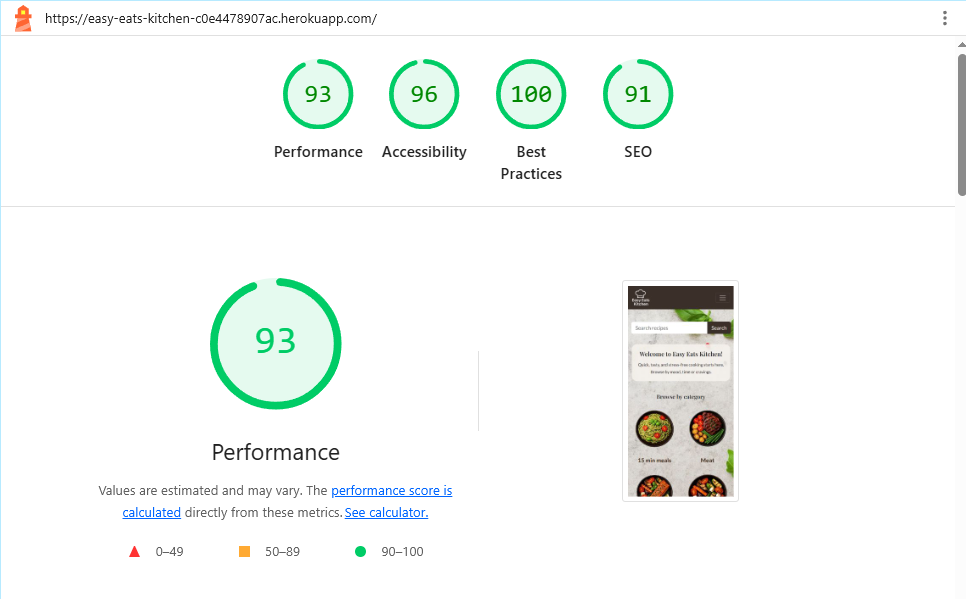

# [Easy Eats Kitchen](https://easy-eats-kitchen-c0e4478907ac.herokuapp.com/)

Developer: Jolanta Djatlova ([jolantadjatlova](https://github.com/jolantadjatlova))

Easy Eats Kitchen is a full-stack web application that allows users to browse, search, and filter recipes, while registered users can create, edit, and delete their own recipes.

The application focuses on clean UX design, accessibility, and secure authentication, providing a simple and practical solution for everyday meal planning with full CRUD functionality.

 

### Contents

- [UX](#ux)
  - [The 5 Planes of UX](#the-5-planes-of-ux)
    - [1. Strategy](#1-strategy)
    - [2. Scope](#2-scope)
    - [3. Structure](#3-structure)
    - [4. Skeleton](#4-skeleton)
    - [5. Surface](#5-surface)
  - [User Goals](#user-goals)
  - [User Stories](#user-stories)

- [Design Choices](#design-choices)
  - [Wireframes](#wireframes)
  - [Typography](#typography)
  - [Colour Scheme](#colour-scheme)
  - [Images](#images)
  - [Responsiveness](#responsiveness)

- [Agile Development Process](#agile-development-process)
  - [Planning Tools & Workflow](#planning-tools--workflow)
    - [GitHub Projects (Kanban)](#github-projects-kanban)
    - [GitHub Issues](#github-issues)
    - [MoSCoW Prioritization](#moscow-prioritization)

- [Features](#features)
  - [Existing Features](#existing-features)
  - [Future Enhancements](#future-enhancements)

- [Data Model & Relationships](#data-model--relationships)
  - [Entity Relationship Diagram](#entity-relationship-diagram)
  - [Database Models](#database-models)
  - [Database Relationships Summary](#database-relationships-summary)
  - [Database Implementation](#database-implementation)

- [CRUD Functionality](#crud-functionality)
- [Security Features](#security-features)
- [Technologies Used](#technologies-used)

- [Testing](#testing)
  - [Automated Testing](#automated-testing)
  - [Bugs](#bugs)
  - [Responsiveness Test](#responsiveness-test)
  - [Code Validation](#code-validation)
    - [HTML](#html)
    - [CSS](#css)
    - [JavaScript](#javascript)
  - [User Story Testing](#user-story-testing)
  - [Form Validation Testing](#form-validation-testing)
  - [Lighthouse Testing](#lighthouse-testing)
  - [Browser Testing](#browser-testing)

- [Deployment](#deployment)
  - [To Deploy the Project](#to-deploy-the-project)
  - [To Fork the Project](#to-fork-the-project)
  - [To Clone the Project](#to-clone-the-project)

- [Credits](#credits)
  - [Feedback, Advice and Support](#feedback-advice-and-support)
  - [Learning Help and Resources](#learning-help-and-resources)
  - [Images](#images-1)

- [Final Tidy-Up](#final-tidy-up)

## UX
### The 5 Planes of UX
#### 1. Strategy
##### Purpose
- Provide a simple and welcoming platform for users to discover and share recipes.
- Allow users to quickly find meal ideas based on time, category, or personal preferences.
- Encourage user engagement through recipe creation and personal recipe management.
- Offer a visually appealing and easy-to-use interface that supports stress-free cooking inspiration.

##### Primary User Needs
- Easily browse and view recipes without needing to create an account.
- Quickly search and filter recipes to find suitable meal ideas.
- Access clear and readable recipe information, including ingredients and method steps.
- Create an account to save, manage, and share personal recipes.
- Access the website seamlessly across mobile, tablet, and desktop devices.

##### Project Goals
- Build a full-stack Django application demonstrating CRUD functionality.
- Implement user authentication to support personalised features.
- Apply UX best practices, including intuitive navigation and responsive design.
- Use consistent styling and clear typography to support readability and usability.

#### 2. Scope

##### Functional Requirements
- Users can browse a list of recipes without needing to create an account.
- Users can view individual recipe detail pages containing ingredients and method steps.
- Users can search for recipes using keywords.
- Users can filter recipes by category.
- Users can register for an account and log in securely.
- Authenticated users can create new recipes.
- Authenticated users can edit their own recipes.
- Authenticated users can delete their own recipes.
- Users can log out of their account.
- The website provides clear UI feedback when forms are submitted or actions are completed.

##### Content Requirements
- Recipe titles, images, ingredients, and method instructions.
- Category-based recipe organisation.
- Clear navigation labels and page headings.
- Form labels and validation messages to guide user input.
- Accessible text and color contrast for readability.

#### 3. Structure

##### Interaction Design
The website follows a simple and intuitive user flow focused on recipe discovery and management. Public users can browse, search, and filter recipes, while authenticated users can access additional features such as creating and managing their own recipes. Clear UI feedback is provided throughout user interactions.

##### Information Architecture
Content is organised into clear sections including the homepage, recipe listings, recipe detail pages, and user account functionality. Categories are used to group recipes and support easy navigation. A consistent layout is maintained across all pages using Bootstrap’s grid system.

##### Navigation Layout
A persistent navigation bar provides access to key areas of the site, including Home, Categories, and user-specific options. The navigation collapses into a mobile-friendly menu on smaller screens to ensure usability across devices.

##### User Flow
Users arrive on the homepage and can immediately browse or search for recipes. Authenticated users are able to add and manage recipes, while public users can continue browsing without registering.

#### 4. Skeleton

Wireframes were used to plan page layout, navigation placement, and content hierarchy before visual styling was applied. Key interface elements such as the navigation bar, search functionality, recipe cards, and forms were positioned to ensure clarity and ease of use across different screen sizes.

The wireframes created can be viewed in the [Wireframes](#wireframes) section.

#### 5. Surface

The surface design of *Easy Eats Kitchen* focuses on creating a warm, welcoming, and food-inspired visual experience. Natural imagery, soft neutral backgrounds, and earthy accent colours help convey a sense of comfort and home cooking. The interface prioritises clarity and readability, ensuring users can easily focus on discovering and managing recipes.

Further visual decisions are detailed in the [Typography](#typography) and [Colour Scheme](#colour-scheme) sections.

[Back to contents](#contents)

---
### User Goals

#### Public Users
- To browse and view recipes without needing to create an account.
- To search and filter recipes in order to quickly find suitable meal ideas.

#### Authenticated Users
- To create an account and log in securely to access additional features.
- To create, edit, and manage personal recipes in one place.
- To interact with other users by leaving comments and sharing cooking tips.
- To receive clear feedback when performing actions such as creating, editing, or deleting content.

### User Stories

#### Public Users
- As a public user, I want to browse a list of recipes and view individual recipe details so that I can find inspiration and cook a meal.  
- As a public user, I want to filter recipes by category so that I can quickly find recipes that suit my preferences.  
- As a public user, I want to search for recipes by keyword so that I can locate specific dishes quickly.

#### Authenticated Users
- As an authenticated user, I want to create an account so that I can create and manage my own recipes.  
- As an authenticated user, I want to log in to my account so that I can access recipe management features.  
- As an authenticated user, I want to create new recipes so that I can save and share my own recipes.  
- As an authenticated user, I want to edit my own recipes so that I can update ingredients or method steps when needed.  
- As an authenticated user, I want to delete my own recipes so that I can remove recipes I no longer want.  
- As an authenticated user, I want to leave comments on recipes so that I can share feedback and tips with other users.

[Back to contents](#contents)

---

## Design Choices

### Wireframes

These wireframes were created using [Balsamiq](https://balsamiq.com/) during the Scope Plane part of the design and planning process for this project.

- [Landing Page (Guest View)](docs/landing_page_guest_view_wireframe.png)
- [Landing Page (Logged-in View)](docs/landing_post_log_in_view_wireframe.png)

- [Recipes (All)](docs/recipes_wireframes.png)
- [My Recipes](docs/my_recipes_wireframes.png)

- [Add Recipe Form](docs/add_recipe_form_wireframes.png)

- [Sign Up](docs/sign_up_wireframe.png)
- [Sign In](docs/sign_in_wireframe.png)

- [404 Page](docs/404_page_wireframes.png)
- [500 Page](docs/500_page_wireframes.png)

### Typography

- The **Playfair Display** typeface is used for headings to create a warm, recipe-style aesthetic that reflects the home-cooking theme of the project.  
- **Lato** is used for body text and navigation due to its clean, simple letterforms, ensuring good readability across different screen sizes.  
- Varying font weights are used to establish clear visual hierarchy between headings, navigation elements, and content text.  
- This typography pairing supports a welcoming and approachable interface while keeping the layout clear and easy to navigate.

### Colour Scheme

The colour palette was designed using [Coolors](https://coolors.co/) and inspired by the *Easy Eats Kitchen* hero imagery and overall food theme. It combines warm, earthy tones with soft neutral colours to create a natural and welcoming feel that reflects home cooking and fresh ingredients. Accent colours are used to highlight interactive elements while keeping the interface calm and easy to navigate.

### Contrast Grid

A contrast grid was used to ensure that text and interactive elements meet accessibility guidelines for contrast and readability across all device types.

[Back to contents](#contents)
---

### Images

The background image used on the *Easy Eats Kitchen* homepage was **generated using ChatGPT (AI image generation)**.

Category images (*15 Min Meals*, *Meat*, *Fish*, *Vegetarian*) were also **AI-generated using ChatGPT** to maintain a consistent visual style across the application and support category-based navigation.

Recipe images are optional and can be uploaded by authenticated users when creating or editing a recipe. These images are displayed within recipe views and are stored and served using **Cloudinary**.

All imagery is designed to remain **non-intrusive**, ensuring that text, navigation, and interactive elements remain clear and accessible.

All images include **descriptive `alt` attributes** to support accessibility.

---
### Responsiveness

The *Easy Eats Kitchen* application is fully responsive and adapts to different screen sizes using **Bootstrap’s responsive grid system**.

The layout, typography, and interactive elements adjust to maintain usability across mobile, tablet, and desktop devices.

- Navigation collapses into a mobile-friendly menu on smaller screens.
- Images, forms, and recipe content scale appropriately without layout issues.
- Buttons and inputs remain accessible and easy to use on touch devices.

Responsiveness was tested using browser developer tools and manual viewport resizing.  
Further details can be found in the **Responsiveness Test** section.

[Back to contents](#contents)

## Agile Development Process

Easy Eats Kitchen was developed using an iterative Agile approach, focusing on delivering a clear and user-friendly Minimum Viable Product (MVP). Development was carried out in small, manageable stages, allowing functionality to be built, tested, and refined incrementally.

The workflow was managed using GitHub Projects (Kanban board) and GitHub Issues, where user stories and tasks were prioritised using the MoSCoW method. This ensured that core functionality such as recipe browsing, searching, authentication, and CRUD operations was implemented first, followed by usability and design improvements.

The overall scope and requirements of the project are outlined in the 5 Planes of UX section.

[Back to contents](#contents)

---

### Planning Tools & Workflow

To stay organised and maintain an Agile workflow throughout development, the following tools were used:

#### GitHub Projects (Kanban)
A Kanban board was created using [GitHub Projects](https://github.com/users/jolantadjatlova/projects/14) to visually manage tasks and track progress. Tasks were broken down into user stories and categorised by status:

- To Do  
- In Progress  
- Done  

This approach helped to:
- Track development progress clearly
- Maintain focus on achievable goals
- Manage workload effectively throughout the project

#### GitHub Issues

GitHub Issues were used to record user stories, development tasks and potential features, with labels applied.

Each issue included clear acceptance criteria and was linked to the relevant stage of development, supporting traceability and structured progress.

#### MoSCoW Prioritization

The MoSCoW prioritisation method was used to classify tasks as Must Have, Should Have or Could Have. This helped ensure that essential functionality was delivered within the project timeframe while allowing flexibility for future enhancements.

[Back to contents](#contents)

---

## Features

### Existing Features

#### Navbar

A single, responsive navigation bar is used across the entire site to provide consistent access to key areas of the application.

The navbar displays the *Easy Eats Kitchen* brand on the left and navigation links on the right. Navigation options update dynamically based on authentication status.

On smaller screens, the navbar collapses into a hamburger menu using Bootstrap’s built-in responsive behaviour.

Key features include:
- Clear site branding
- Authentication-aware navigation links
- Hover and focus styles to indicate active links
- Responsive collapse for mobile and tablet devices

[Desktop navbar](docs/navbar-desktop.png "Desktop navbar")

[Mobile navbar collapsed](docs/navbar-mobile-collapsed.png "Mobile navbar collapsed")

[Mobile navbar expanded](docs/navbar-mobile-expanded.png "Mobile navbar expanded")

---

#### Home Page

The home page acts as a welcoming entry point, allowing users to begin browsing recipes immediately without needing to register.

The page includes:
- A prominent recipe search bar
- A short welcome message introducing the site’s purpose
- Category-based navigation using visual imagery

The layout is clean and uncluttered, encouraging quick discovery of recipes while remaining accessible across all screen sizes.

[Desktop home view](docs/home-desktop.png "Home page desktop view")

[Tablet home view](docs/home-tablet.png "Home page tablet view")

[Mobile home view](docs/home-mobile.png "Home page mobile view")

---

#### Recipe Search

Users can search for recipes using keywords to quickly find relevant results.

The search functionality:
- Matches recipe titles, ingredients, and method content
- Is available to both public and authenticated users
- Updates results clearly based on the entered query

This feature improves usability by reducing the time needed to locate specific recipes.

[Recipe search bar](docs/search-bar.png "Recipe search bar")

---

#### Category Browsing

Recipes are organised into predefined categories to support intuitive navigation.

Available categories include:
- 15 min meals
- Meat
- Fish
- Vegetarian

Each category page displays only relevant recipes and supports optional keyword searching within that category.

[Category page view](docs/category-view.png "Category page view")

---

#### User Registration

New users can register for an account using a secure and user-friendly form.

The registration process includes:
- Clear form labels and guidance
- Automatic validation of required fields
- Password requirements enforced by Django

Upon successful registration, users gain access to recipe management features.

[Registration page](docs/register.png "User registration page")

---

#### Login and Logout

Registered users can log in and out securely using Django Allauth.

Key features include:
- Secure authentication handling
- Clear success messages on login and logout
- Navigation updates based on authentication status
- Redirects to appropriate pages after authentication actions

[Login page](docs/login.png "Login page")

[Logout confirmation](docs/logout.png "Logout confirmation")

---

#### Add Recipe

Authenticated users can create new recipes using a structured form.

The add recipe form allows users to:
- Enter a recipe title
- Select a category
- Upload an optional image
- Add ingredients and method steps using a rich text editor

Successful submissions display confirmation feedback and redirect users to their personal recipe list.

[Add recipe form](docs/add-recipe.png "Add recipe form")

---

#### Edit Recipe

Users can edit recipes they own.

Key features include:
- Edit access restricted to recipe owners only
- Pre-populated form fields for ease of editing
- Confirmation feedback after successful updates

This ensures users maintain full control over their own content.

[Edit recipe form](docs/edit-recipe.png "Edit recipe form")

---

#### Delete Recipe

Users can delete recipes they own through a confirmation step.

Key features include:
- Ownership-based access control
- Confirmation prompt to prevent accidental deletion
- Clear success message after deletion

[Delete recipe confirmation](docs/delete-recipe.png "Delete recipe confirmation")

---

#### My Recipes Page

The My Recipes page provides authenticated users with a central place to manage their own content.

Features include:
- Display of only the logged-in user’s recipes
- Recipes ordered by most recent creation
- Keyword search within personal recipes
- Quick access to edit and delete actions

[My Recipes page](docs/my-recipes.png "My Recipes page")

---

#### User Feedback Messages

Clear feedback messages are shown following key user actions.

Messages are displayed for:
- Successful recipe creation, editing, and deletion
- Invalid form submissions
- Authentication-related actions

Feedback messages improve clarity and user confidence throughout the application.

[Success message example](docs/success-message.png "Example of user feedback message")

---

#### Error Pages

Custom error pages are implemented to improve user experience when an issue occurs.

Included error pages:
- 404 – Page Not Found
- 500 – Server Error

These pages provide clear messaging and maintain visual consistency across the site.

[404 error page](docs/404.png "404 error page")

[500 error page](docs/500.png "500 error page")

[Back to contents](#contents)

---

### Future Enhancements

[Back to contents](#contents)

---

## Data Model & Relationships

The Easy Eats Kitchen application uses a relational database structure with three main models: User, Category, and Recipe. The data model is designed to support full CRUD functionality for recipe management while maintaining clear relationships between entities.

### Entity Relationship Diagram

### Database Models

#### User (Django Authentication)
The User model is provided by Django's built-in authentication system and stores user account information.

**Fields:**
- `id`: AutoField (Primary Key)
- `username`: CharField(150) - Unique username for login
- `email`: EmailField - User's email address
- `password`: CharField(128) - Hashed password

**Relationships:**
- One user can create multiple recipes (One-to-Many with Recipe)

#### Category
The Category model organizes recipes into predefined categories for easy browsing and filtering.

**Fields:**
- `id`: AutoField (Primary Key)
- `name`: CharField(50) - Category name (unique)
- `slug`: SlugField(60) - URL-friendly version of the name (unique, auto-generated)

**Categories available:**
- 15 min meals
- Meat
- Fish
- Vegetarian

**Relationships:**
- One category can contain multiple recipes (One-to-Many with Recipe)

#### Recipe
The Recipe model stores all recipe information created by users.

**Fields:**
- `id`: AutoField (Primary Key)
- `owner`: ForeignKey(User) - Links recipe to the user who created it
- `category`: ForeignKey(Category) - Links recipe to a category (optional, nullable)
- `title`: CharField(120) - Recipe title
- `image`: ImageField - Optional recipe image uploaded by user
- `ingredients`: TextField - List of ingredients (one per line)
- `method`: TextField - Step-by-step cooking instructions
- `created_at`: DateTimeField - Timestamp of recipe creation (auto-generated)
- `updated_at`: DateTimeField - Timestamp of last update (auto-updated)

**Relationships:**
- Each recipe belongs to one user (owner) - Many-to-One with User
- Each recipe can belong to one category - Many-to-One with Category (optional)

### Database Relationships Summary

The application uses **One-to-Many** relationships:

1. **User → Recipe (1:N)**
   - One user can create multiple recipes
   - Each recipe belongs to exactly one user
   - Implemented via ForeignKey on Recipe model
   - `on_delete=CASCADE` ensures recipes are deleted when user is deleted

2. **Category → Recipe (1:N)**
   - One category can contain multiple recipes
   - Each recipe can belong to one category (optional)
   - Implemented via ForeignKey on Recipe model
   - `on_delete=SET_NULL` ensures recipes remain if category is deleted

### Database Implementation

The application uses **PostgreSQL** as the production database (via Heroku) and SQLite3 for local development. Django's ORM abstracts the database layer, allowing the same models to work with both database systems seamlessly.

**Production Database:**
- PostgreSQL (managed by Heroku Postgres)
- Connection configured via `DATABASE_URL` environment variable
- Parsed using `dj-database-url` package

**Local Development Database:**
- SQLite3 (Django default)
- Stored in `db.sqlite3` file (excluded from git)

[Back to contents](#contents)

---

## CRUD Functionality

The application provides full CRUD (Create, Read, Update, Delete) functionality for recipe management:

| Operation | View | Access | Description |
|-----------|------|--------|-------------|
| **Create** | `add_recipe` | Authenticated users | Create new recipes with title, category, image, ingredients, and method using a form with rich text editor |
| **Read** | `recipes_list`, `recipes_by_category`, `my_recipes` | Public (general recipes) / Authenticated (personal recipes) | Browse, search, and view recipe details with accordion interface |
| **Update** | `edit_recipe` | Recipe owner only | Edit existing recipes with pre-populated form data |
| **Delete** | `delete_recipe` | Recipe owner only | Delete recipes with confirmation step to prevent accidents |

[Back to contents](#contents)

---

## Security Features

### Authentication & Authorisation
- User authentication is implemented using **Django Allauth**.
- Only authenticated users can access protected functionality such as creating, editing, and deleting recipes.
- Users are restricted to editing and deleting **only their own recipes**.

### Access Control
- Django’s `@login_required` decorator is used to protect private views.
- Unauthorised access attempts redirect users to the login page.

### Form Validation
- Django ModelForms are used to validate user input.
- Required fields and data types are enforced automatically by Django.
- Invalid form submissions are rejected with clear user feedback messages.

### CSRF Protection
- Django’s built-in Cross-Site Request Forgery (CSRF) protection is enabled on all forms.
- CSRF tokens prevent unauthorised or malicious form submissions.

### Environment Variables & Secure Configuration
- Sensitive data such as `SECRET_KEY`, database credentials, and configuration values are stored in environment variables.
- No sensitive information is committed to the repository.
- `DEBUG` mode is controlled via environment variables and defaults to `False` in production.

[Back to contents](#contents)

---

## Technologies Used

| Technology | Purpose | Type |
|-------------|----------|------|
| [Git](https://git-scm.com/) | Track changes and manage version control throughout development. | Tool |
| [GitHub](https://github.com/) | Store the project repository and manage commits and issues. | Tool |
| [VS Code](https://code.visualstudio.com/) | Write, edit, and organise all project code. | Tool |
| [HTML](https://developer.mozilla.org/en-US/docs/Web/HTML) | Structure page content and templates. | Language |
| [CSS](https://developer.mozilla.org/en-US/docs/Web/CSS) | Style the user interface and control layout and presentation. | Language |
| [JavaScript](https://developer.mozilla.org/en-US/docs/Web/JavaScript) | Enhance interactivity and user experience. | Language |
| [Python](https://www.python.org/) | Implement backend logic, views, and data handling. | Language |
| [Django](https://www.djangoproject.com/) | Backend framework used to build the full-stack application. | Framework |
| [Django Allauth](https://django-allauth.readthedocs.io/en/latest/) | Handle user authentication and account management. | Library |
| [Bootstrap 5](https://getbootstrap.com/) | Provide responsive layout and UI components. | Library |
| [Django Crispy Forms](https://django-crispy-forms.readthedocs.io/en/latest/) | Improve form rendering and styling with Bootstrap. | Library |
| [Django Summernote](https://github.com/summernote/django-summernote) | Provide a rich text editor for recipe content. | Library |
| [PostgreSQL](https://www.postgresql.org/) | Production database for storing application data. | Database |
| [SQLite3](https://www.sqlite.org/index.html) | Local development database. | Database |
| [Cloudinary](https://cloudinary.com/) | Store and serve user-uploaded recipe images. | Cloud Service |
| [Heroku](https://www.heroku.com/) | Deploy and host the live application. | Platform |
| [Balsamiq](https://balsamiq.com/) | Create wireframes for planning page layout and user flow. | Tool |
| [Coolors](https://coolors.co/) | Generate and refine the project colour palette. | Tool |
| [Eight Shapes Contrast Grid](https://contrast-grid.eightshapes.com/) | Test colour contrast and accessibility compliance. | Tool |
| [Squoosh](https://squoosh.app/) | Compress and convert images to WebP format for improved performance. | Tool |
| [remove.bg](https://www.remove.bg/) | Remove image backgrounds for cleaner visuals and consistent presentation. | Tool |
| [Google Fonts](https://fonts.google.com/) | Import and apply typography used across the site. | Library |
| [Font Awesome](https://fontawesome.com/) | Add icons to enhance usability and visual clarity. | Library |
| [ChatGPT](https://chat.openai.com/) | Assist with content writing, code refinement, and AI-generated imagery. | AI |
| [W3C HTML Validation Service](https://validator.w3.org/) | Validate HTML structure and syntax. | Tool |
| [W3C CSS Validation Service](https://jigsaw.w3.org/css-validator/) | Validate CSS syntax and styling rules. | Tool |
| [Lighthouse](https://developer.chrome.com/docs/lighthouse/overview/) | Test performance, accessibility, and best practices. | Tool |
| [WAVE](https://wave.webaim.org/) | Evaluate accessibility compliance. | Tool |

[Back to contents](#contents)

---

## Testing

[Back to contents](#contents)

---
### Automated Testing

Automated testing was implemented using Django’s built-in testing framework.

Tests were written for:
- Models (data integrity and relationships)
- Forms (validation of required fields)
- Views (page loading, authentication, permissions, and CRUD functionality)

All tests were run using the following command:

`python manage.py test --verbosity=2`

This command displays individual test cases and confirms that all components of the application behave as expected.

### Bugs

[Back to contents](#contents)

---

### Responsiveness Test

[Back to contents](#contents)

---

### Code Validation

[Back to contents](#contents)

---

#### HTML

[Back to contents](#contents)

---

#### CSS

[Back to contents](#contents)

---

#### JavaScript

[Back to contents](#contents)

---

### User Story Testing

### Public Users

| User Story | Result | Pass | Evidence |
|-----------|--------|------|----------|
| As a public user, I want to browse a list of recipes and view individual recipe details so that I can find inspiration and cook a meal. | Users can view all recipes and access individual recipe detail pages without logging in. | Yes | [Recipes List View](docs/recipes-list.png "Recipes List View") [Recipe Detail View](docs/recipe-detail.png "Recipe Detail View") |
| As a public user, I want to filter recipes by category so that I can quickly find recipes that suit my preferences. | Recipes are filtered correctly when a category is selected. | Yes | [Category Filter View](docs/category-filter.png "Category Filter View") |
| As a public user, I want to search for recipes by keyword so that I can locate specific dishes quickly. | Keyword search filters recipes by title, ingredients, and method. | Yes | [Search Results View](docs/search-results.png "Search Results View") |

---

### Authenticated Users

| User Story | Result | Pass | Evidence |
|-----------|--------|------|----------|
| As an authenticated user, I want to create an account so that I can create and manage my own recipes. | Users can register successfully using a secure sign-up form. | Yes | [User Registration](docs/user-registration.png "User Registration") |
| As an authenticated user, I want to log in to my account so that I can access recipe management features. | Registered users can log in and access protected pages. | Yes | [User Login](docs/user-login.png "User Login") |
| As an authenticated user, I want to create new recipes so that I can save and share my own recipes. | Logged-in users can add new recipes using a validated form. | Yes | [Add Recipe Form](docs/add-recipe.png "Add Recipe Form") [My Recipes View](docs/my-recipes.png "My Recipes View") |
| As an authenticated user, I want to edit my own recipes so that I can update ingredients or method steps when needed. | Users can edit only recipes they own. | Yes | [Edit Recipe Form](docs/edit-recipe.png "Edit Recipe Form") |
| As an authenticated user, I want to delete my own recipes so that I can remove recipes I no longer want. | Users can delete their own recipes after confirmation. | Yes | [Delete Recipe Confirmation](docs/delete-recipe.png "Delete Recipe Confirmation") |

[Back to contents](#contents)

---

### Form Validation Testing

[Back to contents](#contents)

---

### Lighthouse Testing

Easy Eats Kitchen was tested using **Chrome DevTools Lighthouse** to evaluate overall site quality across key performance and accessibility criteria.

The following areas were assessed:

- **Performance** – measures page load speed and responsiveness.  
- **Accessibility** – evaluates usability for all users, including those using assistive technologies.  
- **Best Practices** – checks adherence to modern web development standards.  
- **SEO** – assesses search engine optimisation and discoverability.

---

**Test for Mobile:**  

**Test for Desktop:**  

[Back to contents](#contents)

---

### Browser Testing

[Back to contents](#contents)

---

## Deployment

[Back to contents](#contents)

---

### To Deploy the Project

[Back to contents](#contents)

---

### To Fork the Project

[Back to contents](#contents)

---

### To Clone the Project

[Back to contents](#contents)

---

## Credits

[Back to contents](#contents)

---

### Feedback, Advice and Support

[Back to contents](#contents)

---

### Learning Help and Resources

[Back to contents](#contents)

---

### Images

[Back to contents](#contents)

---

## Final Tidy-Up

[Back to contents](#contents)